"# e-banking" 
<h1>Spring Angular Spring Security JWT : E-Banking</h1>
<h2>Introduction</h2>

Le but est de créer une application pour gérer les comptes bancaires en suivant un processus en trois étapes essentielles. Tout d'abord, il s'agit de développer la couche DAO avec Spring Boot, puis de concevoir l'interface utilisateur avec Angular, et enfin, de garantir la sécurité en utilisant Spring Security et les JSON Web Tokens.

Cette application offrira une gestion complète des comptes bancaires, en différenciant deux types : les comptes courants et les comptes épargne.

<h2>Conception:</h2>
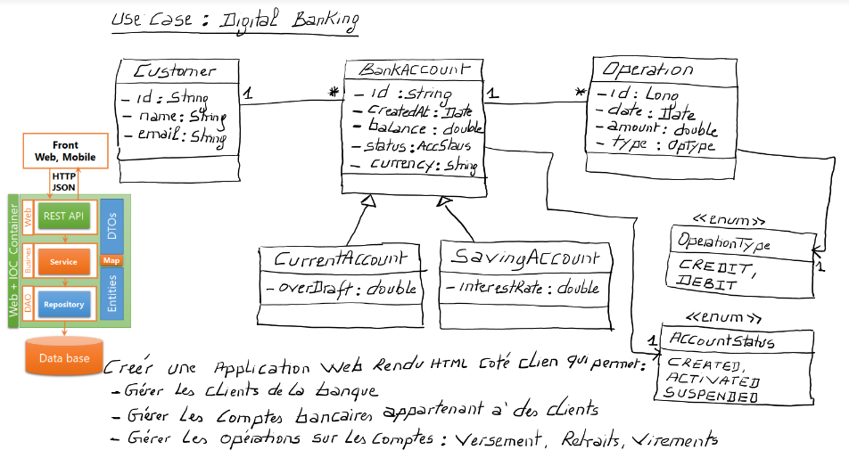

<h2>Partie 1 : Couche DAO et Service</h2>

<h3>Création du Projet Spring Boot:</h3>

La première étape de notre projet consiste à mettre en place l'environnement de développement en créant un projet Spring Boot. Grâce à son infrastructure simplifiée, Spring Boot facilite le développement d'applications Java en permettant une configuration rapide et une gestion aisée des dépendances.

<h3>Création des entités JPA : Customer, BankAccount, Saving Account, CurrentAccount, AccountOperation:</h3>

Une fois le projet Spring Boot mis en place, la prochaine étape cruciale consiste à créer les entités JPA (Java Persistence API). Ces entités, telles que Customer, BankAccount, Saving Account, CurrentAccount et AccountOperation, définissent la manière dont les données sont organisées et manipulées par l'application. Chaque entité correspond à une table dans la base de données, et les relations entre elles reflètent la logique métier propre au système bancaire.

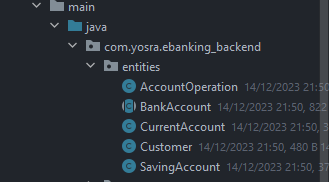

<h3>Création des interfaces JPA Repository basées sur Spring Data:</h3>

Les interfaces JPA Repository, intégrées à Spring Data, jouent un rôle essentiel en simplifiant l'accès aux données. En définissant ces interfaces, nous tirons parti de la capacité de Spring Data à générer automatiquement les requêtes SQL nécessaires pour les opérations CRUD (Create, Read, Update, Delete). Cette méthode simplifie considérablement la couche DAO en évitant la rédaction manuelle de requêtes SQL.

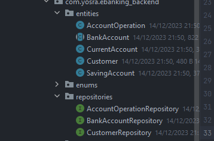

<h3>Mapping Héritage:</h3>

Dans ce projet nous allons essayer les 3 strategies à noter le Single Table , Table Per class et Joined

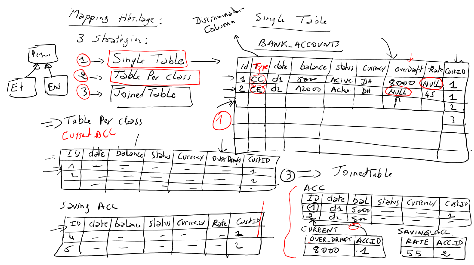

<h4>Stratégie "Single Table":</h4>

CurentAccount 

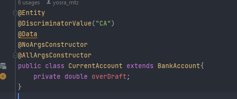

SavingAccount 

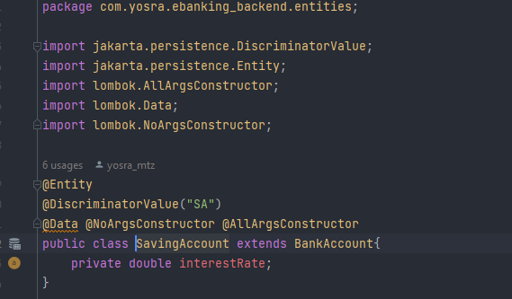

BankAccount 

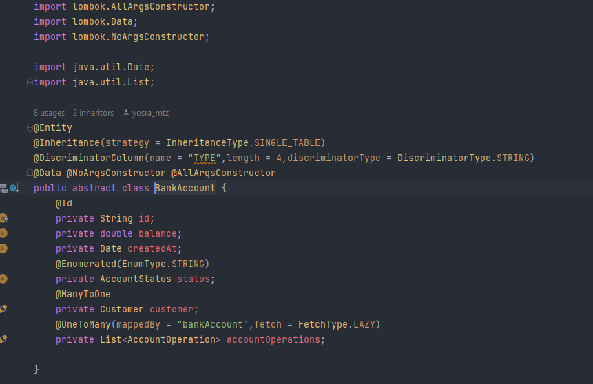

Simulation H2database : all customers

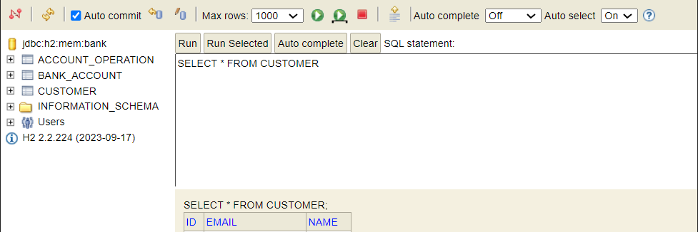

Simulation H2database : Bank_Account Customer 

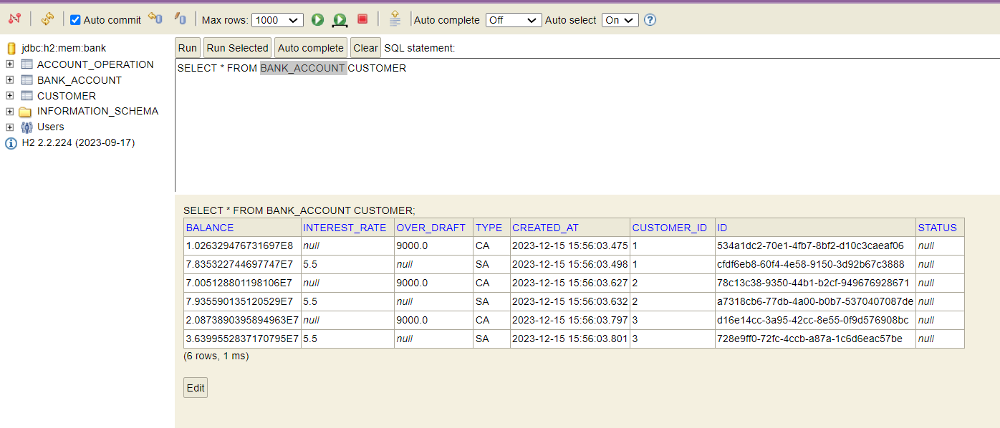

Simulation H2database : Account_Operation Customer 

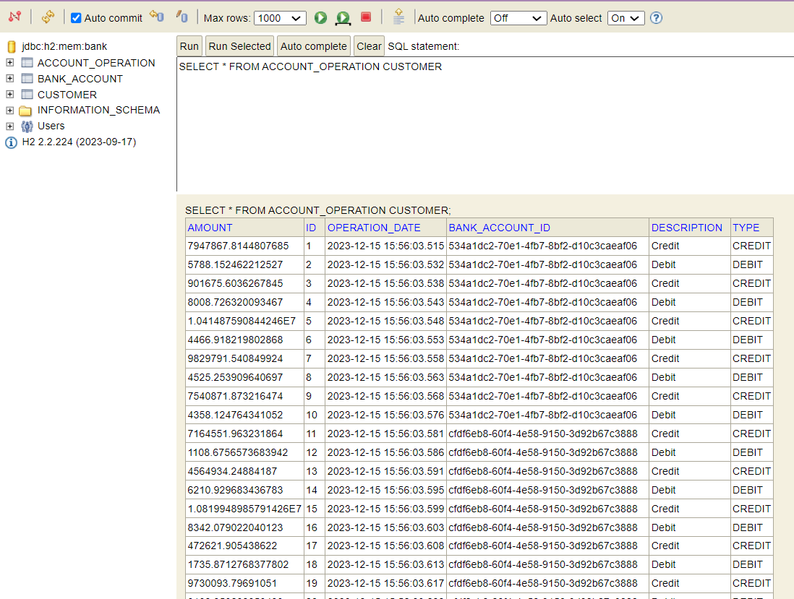

<h4>Stratégie "Table Per Class":</h4>

CurentAccount

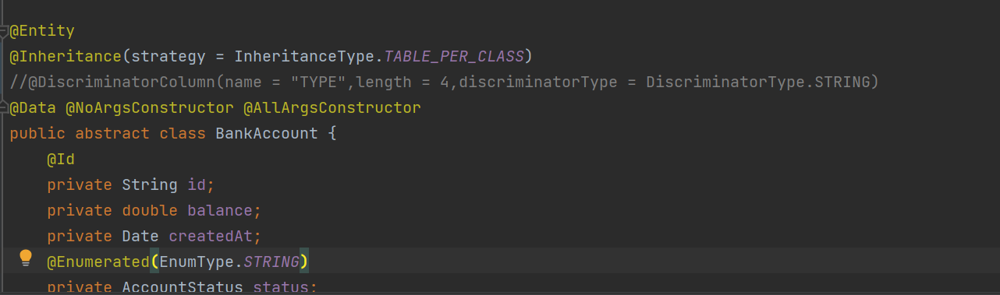

SavingAccount 

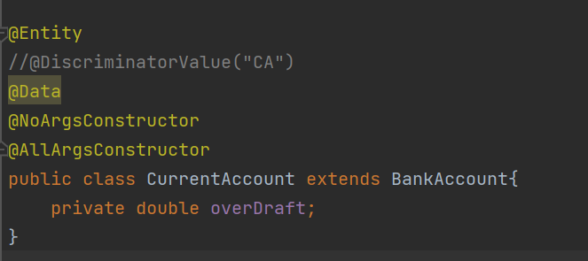

BankAccount 

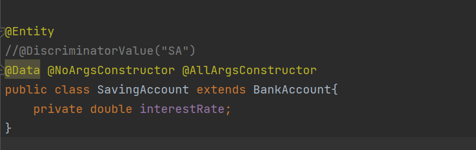

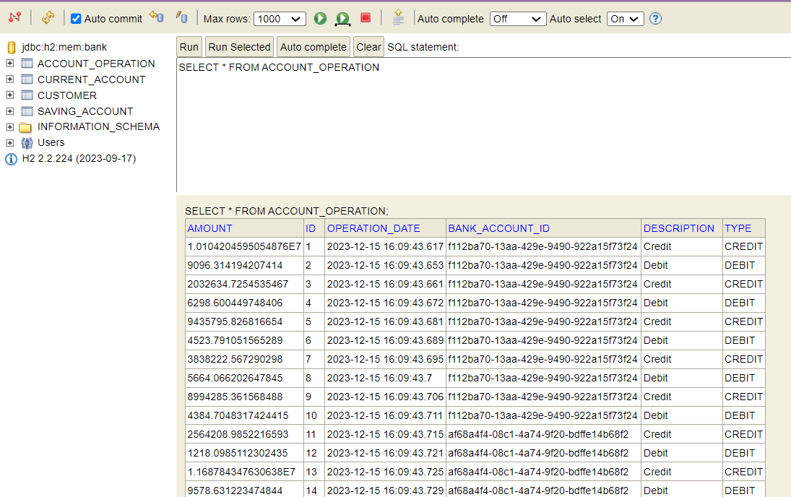
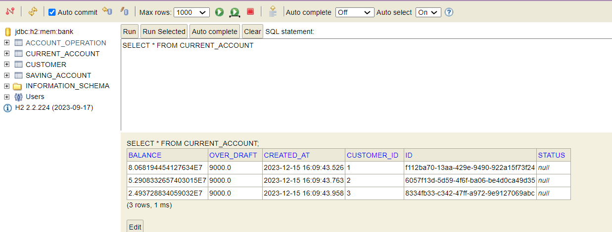
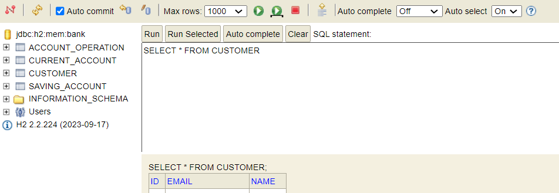
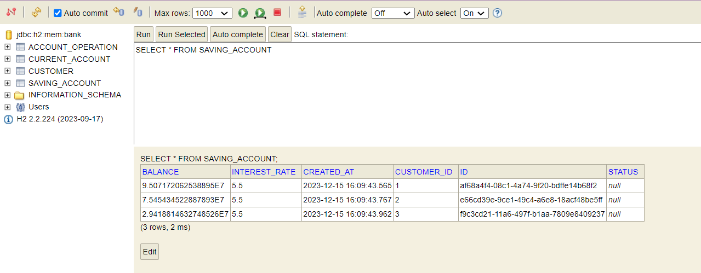

<h4>Stratégie "Joined":</h4>

CurentAccount 

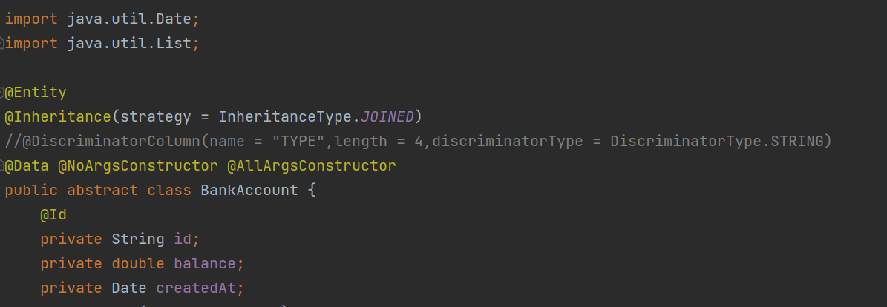

SavingAccount

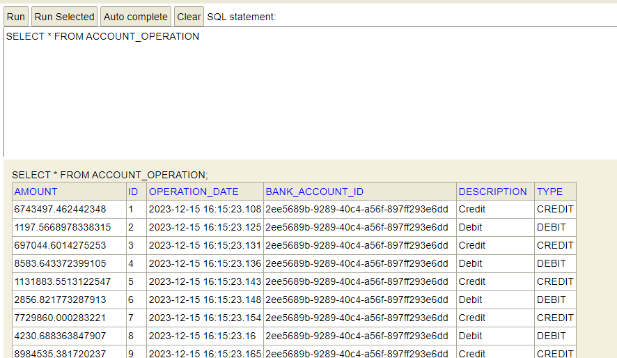

BankAccount 

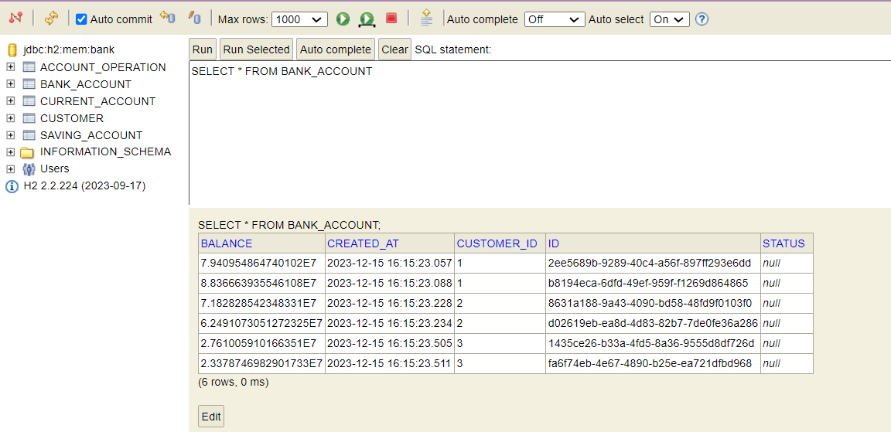

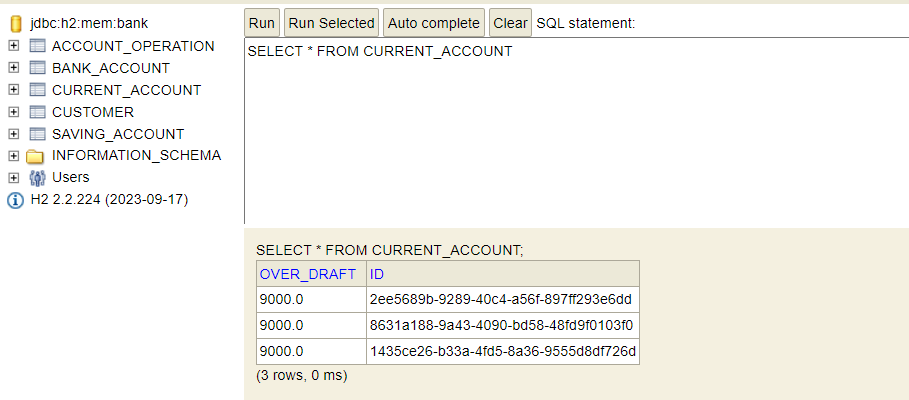
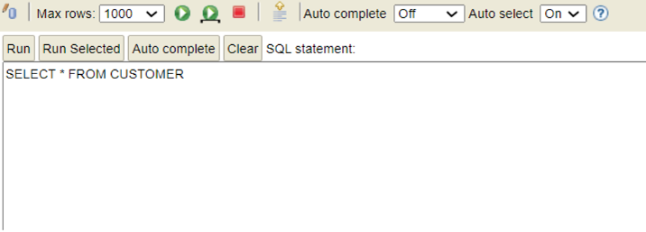

<h3>Consultation d'un customer:</h3>
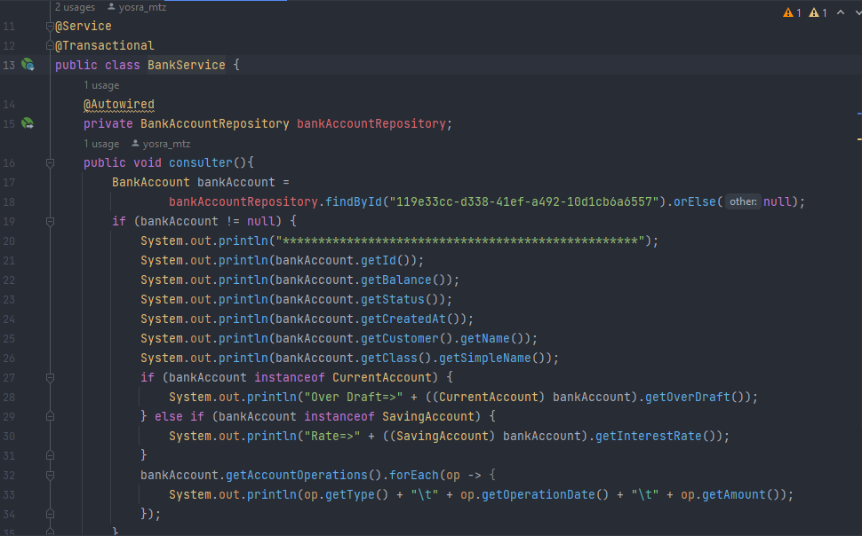

<h3>Basculement vers MySQL en utilisant la stratégie "Single Table":</h3>
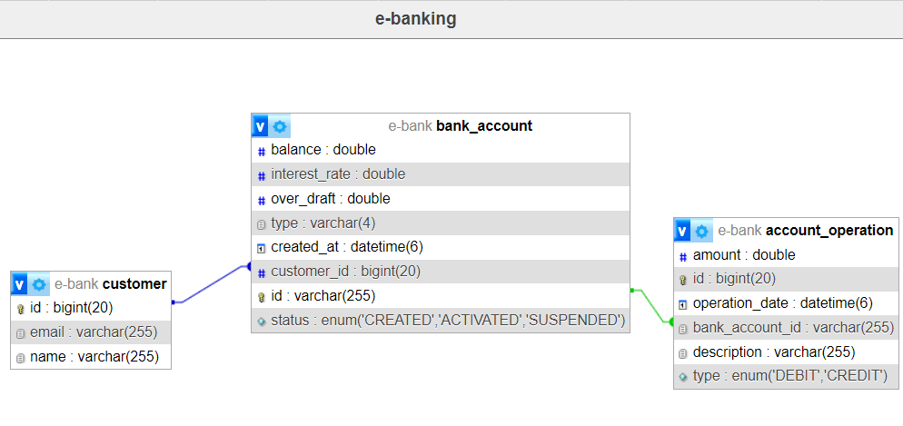

<h3>Affichage des customers sous format json:</h3>
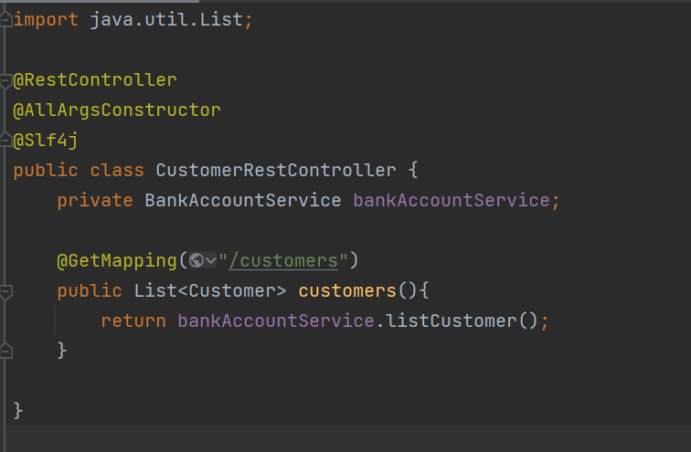

